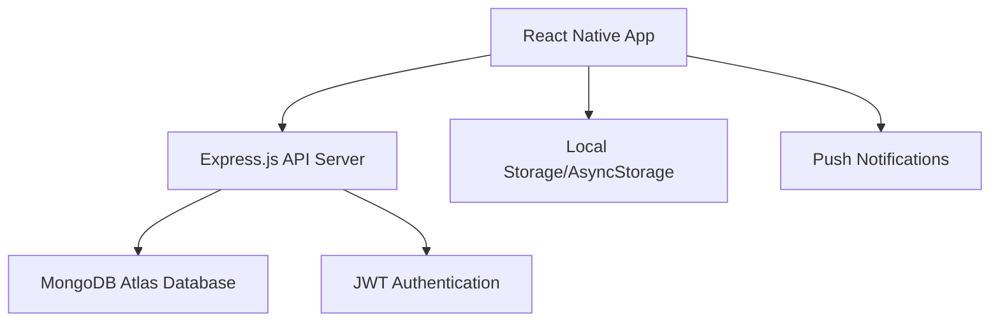

# Design Document

## Overview

TheLastCigarette is a cross-platform mobile application built with React Native and Expo, designed to help users quit smoking through gradual reduction, behavioral tracking, and motivational support. The app follows a client-server architecture with a React Native frontend, Node.js/Express backend, and MongoDB Atlas database.

The design emphasizes user experience through intuitive navigation, real-time progress feedback, and immediate access to support tools during cravings. The app implements a progressive reduction methodology rather than cold-turkey quitting, making it more sustainable for users.

## Architecture

### High-Level Architecture



### Technology Stack

**Frontend (Mobile App):**

- React Native with Expo SDK for cross-platform development
- Redux Toolkit for state management
- React Native Paper for UI components
- React Navigation for screen navigation
- AsyncStorage for local data persistence
- Expo Notifications for push notifications

**Backend (API Server):**

- Node.js with Express.js framework
- JWT for authentication and session management
- bcrypt for password hashing
- Mongoose ODM for MongoDB interactions
- Express middleware for CORS, rate limiting, and validation

**Database:**

- MongoDB Atlas (cloud-hosted)
- Collections: users, cig_logs, journal_entries, achievements

**Hosting & Deployment:**

- Backend: Render.com free tier
- Database: MongoDB Atlas free tier (500MB)
- Mobile App: Expo Application Services (EAS) for builds

## Components and Interfaces

### Frontend Component Architecture

```
src/
├── components/
│   ├── common/
│   │   ├── Button.js
│   │   ├── ProgressBar.js
│   │   └── LoadingSpinner.js
│   ├── auth/
│   │   ├── LoginForm.js
│   │   └── SignupForm.js
│   ├── home/
│   │   ├── DashboardCard.js
│   │   ├── QuickLogButton.js
│   │   └── ProgressIndicator.js
│   ├── progress/
│   │   ├── ConsumptionChart.js
│   │   ├── SavingsDisplay.js
│   │   └── AchievementsList.js
│   ├── journal/
│   │   ├── MoodSelector.js
│   │   ├── CravingSlider.js
│   │   └── JournalHistory.js
│   └── sos/
│       ├── CravingSOS.js
│       ├── BreathingExercise.js
│       └── DelayTimer.js
├── screens/
│   ├── AuthScreen.js
│   ├── HomeScreen.js
│   ├── ProgressScreen.js
│   ├── JournalScreen.js
│   └── SettingsScreen.js
├── services/
│   ├── api.js
│   ├── auth.js
│   └── storage.js
├── store/
│   ├── authSlice.js
│   ├── userSlice.js
│   ├── logsSlice.js
│   └── store.js
└── utils/
    ├── calculations.js
    ├── dateHelpers.js
    └── validators.js
```

### Backend API Structure

```
server/
├── models/
│   ├── User.js
│   ├── CigLog.js
│   ├── JournalEntry.js
│   └── Achievement.js
├── routes/
│   ├── auth.js
│   ├── cigs.js
│   ├── plan.js
│   ├── stats.js
│   └── journal.js
├── middleware/
│   ├── auth.js
│   ├── validation.js
│   └── rateLimiting.js
├── controllers/
│   ├── authController.js
│   ├── cigsController.js
│   ├── statsController.js
│   └── journalController.js
└── utils/
    ├── calculations.js
    ├── achievements.js
    └── notifications.js
```

### API Endpoints Design

**Authentication Endpoints:**

- `POST /api/auth/signup` - User registration
- `POST /api/auth/login` - User authentication
- `POST /api/auth/logout` - Session termination
- `GET /api/auth/verify` - Token validation

**Cigarette Logging Endpoints:**

- `POST /api/cigs/log` - Log a cigarette
- `GET /api/cigs/today` - Get today's count
- `GET /api/cigs/history` - Get consumption history
- `DELETE /api/cigs/:id` - Remove logged cigarette

**Quit Plan Endpoints:**

- `POST /api/plan/setup` - Initial quit plan setup
- `PUT /api/plan/update` - Modify existing plan
- `GET /api/plan/current` - Get current plan details
- `GET /api/plan/targets` - Get daily targets

**Statistics Endpoints:**

- `GET /api/stats/progress` - Overall progress data
- `GET /api/stats/savings` - Money saved calculations
- `GET /api/stats/achievements` - User achievements
- `GET /api/stats/streaks` - Success streaks

**Journal Endpoints:**

- `POST /api/journal/entry` - Create journal entry
- `GET /api/journal/entries` - Get journal history
- `PUT /api/journal/:id` - Update journal entry
- `DELETE /api/journal/:id` - Delete journal entry

## Data Models

### User Model

```javascript
{
  _id: ObjectId,
  email: String (unique, required),
  passwordHash: String (required),
  profile: {
    name: String,
    joinDate: Date,
    timezone: String
  },
  quitPlan: {
    startDate: Date,
    targetQuitDate: Date,
    initialDailyAverage: Number,
    currentDailyLimit: Number,
    reductionFrequency: Number, // days
    reductionAmount: Number,
    cigaretteCost: Number
  },
  settings: {
    remindersEnabled: Boolean,
    punishmentsEnabled: Boolean,
    donationAmount: Number,
    treatsList: [String]
  },
  createdAt: Date,
  updatedAt: Date
}
```

### Cigarette Log Model

```javascript
{
  _id: ObjectId,
  userId: ObjectId (ref: User),
  timestamp: Date,
  count: Number (default: 1),
  location: String (optional),
  trigger: String (optional),
  createdAt: Date
}
```

### Journal Entry Model

```javascript
{
  _id: ObjectId,
  userId: ObjectId (ref: User),
  date: Date,
  mood: String (enum: ['happy', 'neutral', 'sad', 'angry']),
  cravingIntensity: Number (1-10),
  notes: String (optional),
  triggers: [String],
  createdAt: Date,
  updatedAt: Date
}
```

### Achievement Model

```javascript
{
  _id: ObjectId,
  userId: ObjectId (ref: User),
  type: String (enum: ['streak', 'savings', 'reduction', 'milestone']),
  name: String,
  description: String,
  unlockedAt: Date,
  value: Number (associated metric value)
}
```

## Error Handling

### Frontend Error Handling

- Network connectivity errors with retry mechanisms
- Form validation with real-time feedback
- Authentication errors with clear user messaging
- Offline mode with local data queuing
- Graceful degradation for non-critical features

### Backend Error Handling

- Structured error responses with consistent format
- Input validation using express-validator
- Database connection error handling
- Rate limiting to prevent abuse
- Comprehensive logging for debugging

### Error Response Format

```javascript
{
  success: false,
  error: {
    code: "VALIDATION_ERROR",
    message: "User-friendly error message",
    details: {
      field: "Specific field error"
    }
  },
  timestamp: "2024-01-15T10:30:00Z"
}
```

## Testing Strategy

### Frontend Testing

- **Unit Tests**: Component logic using Jest and React Native Testing Library
- **Integration Tests**: API service interactions and Redux state management
- **E2E Tests**: Critical user flows using Detox
- **Manual Testing**: Device-specific testing on iOS and Android

### Backend Testing

- **Unit Tests**: Individual function and utility testing with Jest
- **Integration Tests**: API endpoint testing with Supertest
- **Database Tests**: Model validation and query testing
- **Load Testing**: Performance testing for concurrent users

### Test Coverage Goals

- Minimum 80% code coverage for critical paths
- 100% coverage for authentication and data validation
- Comprehensive testing of calculation utilities
- Error scenario testing for all API endpoints

### Testing Environment Setup

- Separate test databases for isolation
- Mock external services and notifications
- Automated testing in CI/CD pipeline
- Device testing on multiple screen sizes and OS versions

## Security Considerations

### Authentication & Authorization

- JWT tokens with appropriate expiration times
- Password hashing using bcrypt with salt rounds
- Secure token storage using Expo SecureStore
- Session management with refresh token rotation

### Data Protection

- Input sanitization and validation on all endpoints
- SQL injection prevention through parameterized queries
- XSS protection through proper data encoding
- Rate limiting to prevent brute force attacks

### Privacy & Compliance

- Minimal data collection principle
- User consent for data processing
- Secure data transmission using HTTPS
- Data retention policies and user deletion rights

## Performance Optimization

### Frontend Optimization

- Lazy loading of screens and components
- Image optimization and caching
- Efficient Redux state structure
- Debounced API calls for real-time features

### Backend Optimization

- Database indexing on frequently queried fields
- Response caching for static data
- Connection pooling for database efficiency
- Pagination for large data sets

### Monitoring & Analytics

- Performance monitoring using Expo Analytics
- Error tracking and crash reporting
- User engagement metrics
- API response time monitoring
